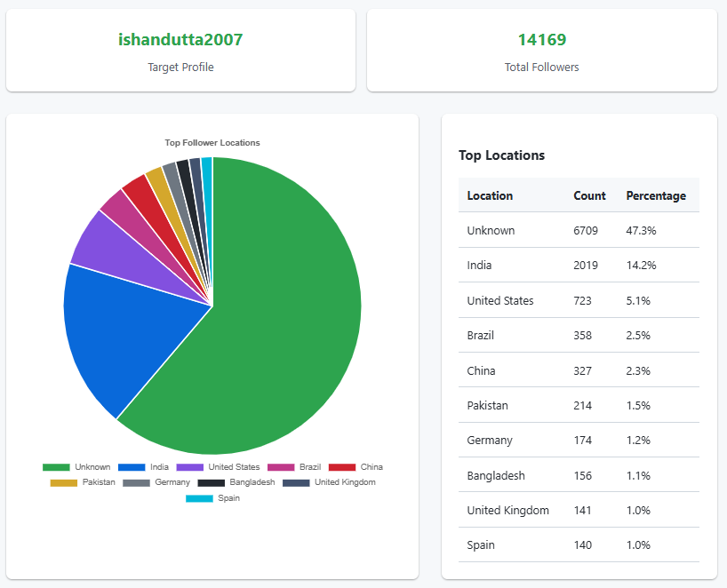

<div align="center">
  

  # 📊 GitHub Follower Analytics

  <p align="center">
    <strong>Understand your GitHub audience with powerful visual insights and demographic data analysis.</strong>
  </p>

  <p align="center">
    <a href="https://github.com/ishandutta2007/Awesome-Awesome-Awesome"></a>
    <a href="https://www.python.org/"></a>
    <a href="LICENSE"></a>
    <a href="https://github.com/ishandutta2007/Github-Follower-Analytics/stargazers"></a>
    <a href="https://github.com/ishandutta2007/Github-Follower-Analytics/issues"></a>
    <a href="https://github.com/ishandutta2007"></a>
  </p>
</div>

**GitHub Follower Analytics** is a powerful, Python-based SEO-optimized tool designed to help developers, open-source maintainers, and content creators deeply understand their audience. By intelligently leveraging the GitHub API, this application fetches follower data, cleans up geographical information, and generates insightful, beautiful visualizations of your follower demographics.

---

## ✨ Key Features

- 🤖 **Automated Data Fetching**: Effortlessly retrieves all followers for any given GitHub username, seamlessly handling pagination.
- 💾 **Smart Local Caching**: 
    - **Followers List**: Cached in `cache/followers_cache.json` with a **24-hour expiry** to ensure fresh data daily while avoiding redundant GitHub API calls.
    - **User Profiles**: Cached in `cache/users_cache.json` using **idempotent logic by username**, ensuring each profile is only fetched once and never re-processed.
- 🌍 **Location Normalization**: Intelligently cleans and normalizes location strings (e.g., "US", "USA", "United States" ➡️ "United States") for accurate geographic reporting.
- 📈 **Visual Analytics**: Generates a beautiful pie chart showing the top geographical regions of your followers.
- ⏳ **Rate Limit Management**: Includes built-in sleep logic to handle GitHub API rate limits gracefully without crashing.
- 🔐 **Environment Variable Support**: Securely manage your GitHub Personal Access Token using `.env` files.

---

## 🛠️ Tech Stack

- **Core Language**: [Python 3](https://www.python.org/) 🐍
- **API Interaction**: [Requests](https://requests.readthedocs.io/) 🌐
- **Data Processing**: Python Standard Library (`collections.Counter`) 🧮
- **Data Visualization**: [Matplotlib](https://matplotlib.org/) 📉
- **Environment Management**: [Python-Dotenv](https://pypi.org/project/python-dotenv/) ⚙️

---

## 📥 Installation Guide

Get up and running with GitHub Follower Analytics in minutes.

1. **Clone the repository:**
   ```bash
   git clone https://github.com/ishandutta2007/Github-Follower-Analytics.git
   cd Github-Follower-Analytics
   ```

2. **Set up a virtual environment (highly recommended):**

   *Option A: Using standard `venv`*
   ```bash
   python -m venv venv
   source venv/bin/activate  # On Windows: venv\Scripts\activate
   ```

   *Option B: Using `pyenv` and `pyenv-virtualenv` (Alternative)*
   ```bash
   pyenv virtualenv 3.11.4 github-followers-env
   pyenv activate github-followers-env
   ```

3. **Install project dependencies:**
   ```bash
   pip install -r requirements.txt
   ```

4. **Configure environment variables:**
   - Rename `.env.example` to `.env`.
   - Add your [GitHub Personal Access Token](https://github.com/settings/tokens) to the `ADMIN_TOKEN` field. This is recommended to significantly increase your API rate limits.

---

## 📖 How to Use

### 🌐 Web Dashboard (Recommended)
The project includes a modern, interactive web interface for easier accessibility.
1. Navigate to the `web_ui` directory:
   ```bash
   cd web_ui
   ```
2. Start the FastAPI server:
   ```bash
   python main.py
   ```
3. Open your browser and go to `http://127.0.0.1:8000`.
4. Enter any GitHub username to instantly see their follower demographics! 🎉

### 💻 CLI Version
You can still run the powerful data analysis directly from your terminal.
1. Run the script:
   ```bash
   python github_followers_analytics.py
   ```
   *Note: To change the target user in CLI, simply update the `GITHUB_USERNAME` variable in `github_followers_analytics.py`.*

---

## 📊 Sample Visualization Dashboard

Here is an example of the generated analytics visualizations:

<div align="center">
  
</div>

---

## 🤝 Contributing

We love contributions! If you have suggestions for new features, better location normalization rules, or improved visualizations, please feel free to contribute:

1. 🍴 Fork the Project
2. 🌱 Create your Feature Branch (`git checkout -b feature/AmazingFeature`)
3. 💾 Commit your Changes (`git commit -m 'Add some AmazingFeature'`)
4. 🚀 Push to the Branch (`git push origin feature/AmazingFeature`)
5. 🔄 Open a Pull Request

---

## 📝 License

This project is logically distributed under the MIT License. See the `LICENSE` file for more details.

---

## 📧 Contact Information

**Ishan Dutta** - [@ishandutta2007](https://github.com/ishandutta2007)

**Project Link**: [https://github.com/ishandutta2007/Github-Follower-Analytics](https://github.com/ishandutta2007/Github-Follower-Analytics)

---

## 📈 Project Star History

<div align="center">
   <a href="https://www.star-history.com/?repos=ishandutta2007%2FGithub-Follower-Analytics&type=date&legend=bottom-right">
    <picture>
      <source media="(prefers-color-scheme: dark)" srcset="https://api.star-history.com/chart?repos=ishandutta2007/Github-Follower-Analytics&type=date&theme=dark&legend=bottom-right" />
      <source media="(prefers-color-scheme: light)" srcset="https://api.star-history.com/chart?repos=ishandutta2007/Github-Follower-Analytics&type=date&legend=bottom-right" />
      
    </picture>
   </a>
</div>

---

**Keywords**: GitHub API, Follower Analytics, Data Visualization, Python, Matplotlib, GitHub Demographics, Social Analytics, Developer Tools, Follower Tracking, Open Source Insights, SEO, Developer Dashboard.
